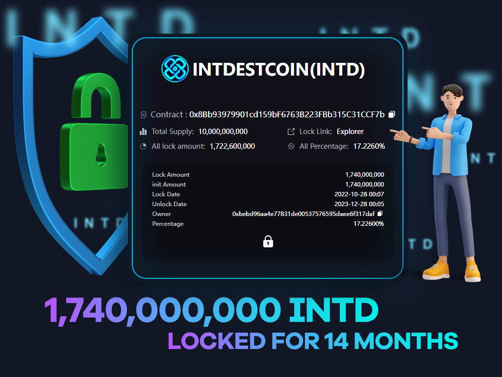

# 
# 
## INTD Lockup process
> 10,000,000,000    INTD Total supply 
  1,740,000,000     Locked for 14 months
Token lockup refers to a time period during which cryptocurrency tokens cannot be exchanged or traded.
Token lock-up (or vesting period) is a time span, generally following a token sale, during which token holders of a cryptocurrency project are not permitted to sell their tokens. The lock-up period assists initiatives in avoiding liquidity issues while new projects are still building their supporting base.
Thanks to lock-up periods, the INTD project will earn more money because of both the demand and the value of the token rise. However, the main reason for instituting a lock-up period is that it protects the market from being bombarded with excessive tokens, which in turn lowers the value of the INTD due to increased sales.
